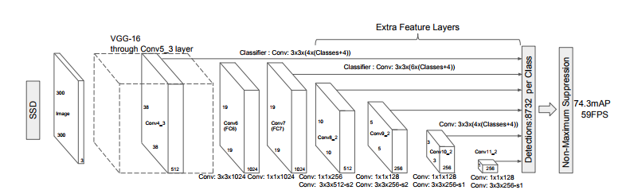

# Object Detection Coding Challenge

## Introduction

For this challenge, we are given an image of an excavator, and want to detect 3 parts - the hoe, body, and wheels. My solution involves training various object recognition algorithms based on convolutional neural networks. These include: 

1. Single Shot MultiBox Detector (SSD) using Inception V2 for image classification
2. Faster R-CNN using Resnet 101 for image classification
3. Faster R-CNN using Inception Resnet V2 for image classification

Each of these algorithms has different trade offs in terms of accuracy and speed. These details can be found in the 'Solution details' section.

Bounding box predictions for all videos are available on Youtube here: https://www.youtube.com/playlist?list=PLzDzaGOv0EykiMQwuk974kRjDsNSXx4pK

Below is an example frame and its associated bounding box predictions made by Faster R-CNN + Resnet 101.

 

Here is a doc defining an architecture for putting this code into production: https://docs.google.com/document/d/1ouNr4VEtAOLA2UbAgtSV5P0M43KUvh14UfGD5_7zxHI/edit?usp=sharing

## Code

### Install dependencies
1. Install docker. See https://docs.docker.com/engine/getstarted/step_one/ for instructions.
2. Clone this repository: `git clone https://github.com/tstramer/object_detection_challenge.git`

### Build and run the app
1. Open a command-line terminal and cd into the root of the project
2. Type `./dev setup_docker` (this may take several minutes)
3. Type `./dev attach_docker`

You should now be attached to a docker container.

## Common tasks

All the tasks below assume you are running commands within the docker container.

### Make predictions

To predict the bounding boxes for an image:

```shell
./dev predict data/pascal_voc/JPEGImages/komatsu9_frame001.jpg docker_output/komatsu9_frame001_lbld.jpg
```

Any files put in the `docker_output` folder will automatically be synced with the host machine.

To predict the bounding boxes for an entire movie:

```shell
wget http://object-detection-challenge.s3.amazonaws.com/movies/movie9.avi
./dev predict movie9.avi docker_output/movie9_labeled.avi
```

### Train a model

#### Download pretrained models

I used the weights of pretrained models trained on various datasets (COCO, OpenImages, etc) to initialize the model weights for the lower levels of the network. The lower levels tend to extract more generic features from images useful across datasets.

To download the pretrained models used for training the models included with this project, run the following from the project root:

```shell
wget http://object-detection-challenge.s3.amazonaws.com/pretrained_models.zip
unzip pretrained_models.zip
```

#### Run the trainer

Start training:

```shell
./dev train config/ssd_inception_v2.config ssd_training_output
```

Once the model is finished training, run:

```shell
./dev create_graph ssd_training_output/model.ckpt-xxx models/ssd_inception_v2_new config/ssd_inception_v2.config
```
where model.ckpt-xxx corresponds to the model outputted by tensorflow you want to use for inference.

You should now be able to make predictions using the new model by running:

```shell
./dev predict_custom data/pascal_voc/JPEGImages/komatsu9_frame001.jpg docker_output/komatsu9_frame001_lbld.jpg models/ssd_inception_v2_new
```

#### Add a new model

There are pretrained models for various object detection model architectures (SSD, faster r-cnn, etc) available via the Tensorflow model zoo. To train a new model on one of these architectures, do the following:

1. Download and extract the desired pretrained model from https://github.com/tensorflow/models/blob/master/research/object_detection/g3doc/detection_model_zoo.md and place it in the {PROJECT_ROOT}/pretrained_models directory
2. Download the corresponding configuration file for the pretrained model from https://github.com/tensorflow/models/tree/master/research/object_detection/samples/configs and place it in the {PROJECT_ROOT}/config directory
3. Make the following changes to the configuration file
  - Change `num_classes` to 3
  - Increase `batch_size` (amount depends on GPU constraints) 
  - Change `fine_tune_checkpoint` to `/app/pretrained_models/{PRETRAINED_MODEL_NAME}/model.ckpt
  - Change `input_path` within the `train_input_reader` struct to '/app/data/tf_records/train.record'
  - Change `input_path` within the `val_input_reader` struct to '/app/data/tf_records/val.record'
  - Change all `label_map_path` fields (2 total) to '/app/data/label_map.pbtxt'

From here, follow the steps in the section `Run the trainer` to actually train the new model.

## Solution details

I trained both SSD and Faster R-CNN models. Both apply a convolutional neural network (usually pretrained on ImageNet) to extract features from the image and then use these features to 1) make bounding box predictions and 2) classify those bounding boxes.

Below are brief descriptions (mostly plagiarized from the associated papers) of the object detection models and image classification models used.

### Models

#### Single Shot MultiBox Detector (SSD)

SSD [[1]] is an object detection system based on a feed-forward convolutional network that produces a fixed-size collection of bounding boxes and scores for the presence of object class instances in those boxes, followed by a non-maximum suppression step to produce the final detections. The early network layers are based on a standard architecture used for high quality image classification (truncated before any classification layers) . 




#### Faster R-CNN

Faster R-CNN [[2]] is an object detection system composed of two modules. The first module is a deep fully convolutional network that proposes regions,
and the second module is the Fast R-CNN detector that uses the proposed regions. The entire system is a single, unified network for object detection . 

A Fast R-CNN [[3]] network takes as input an entire image and a set of object proposals. The network first processes the whole image with several convolutional (conv) and max pooling layers to produce a conv feature map. Then, for each object proposal a region of interest (RoI) pooling layer extracts a fixed-length feature vector from the feature map. Each feature vector is fed into a sequence of fully connected (fc) layers that finally branch into two sibling output layers: one that produces softmax probability estimates over K object classes plus a catch-all “background” class and another layer that outputs four real-valued numbers for each of the K object classes. Each set of 4 values encodes refined bounding-box positions for one of the K classes . 


#### Inception

Inception [[4], [5]] is a deep convolutional neural network architecture that was originally trained to classify ImageNet images. The main hallmark of this architecture is the improved utilization of the computing resources inside the network. This was achieved by a carefully crafted design that allows for increasing the depth and width of the network while keeping the computational budget constant. To optimize quality, the architectural decisions were based on the Hebbian principle and the intuition of multi-scale processing. 


#### Resnet

Resnet [[6]] is a deep convolutional network architecture that was originally trained to classify ImageNet & COCO images. On the ImageNet dataset a residual net with a depth of up to 152 layers—8×deeper than VGG nets is achieved. Resnet uses a residual learning framework to ease the training of networks that are substantially deeper than those used previously. It explicitly reformulate the layers as learning residual functions with reference to the layer inputs, instead
of learning unreferenced functions. 


### Training & Evaluation

SSD and Faster R-CNN both use a multi-task loss function consisting of:
  1. Localization (smoothed L1) loss: How close are the bounding boxes the model creates to the ground truth boxes (only calculated on boxes with matched ground truth boxes)
  2. Confidence (softmax) loss: How accurately does the model predict the class of each object, with hard negative mining for background boxes (select the most difficult background box)

To evaluate each model, mean average precision (mAP), a standard benchmark in the PASCAL VOC challenge [[7]], is measured on a held out test set. It is defined as follows:
  1. Average precision measures how close predicted bounding boxes are to the ground truth for a given class. It is defined as the precision averaged over all values of recall between 0 and 1 (note that for PASCAL VOC, a slightly different version called interpolated average precision is used). In the context of object detection, a predicted bounding box is considered correct if it 1) overlaps sufficiently with a ground truth box, defined by a intersection over union (IOU) threshold (usually .5) and 2) the max classification score corresponds to the class of the ground truth box. 
  2. Mean average precision is the mean AP over all classes.

Each image is resized to be 600x600 (faster r-cnn) or 300x300 (SSD) before training and inference. This allows for a batch size > 1. Even though this may change the aspect ratio, it has been reported to not affect performance on standard datasets like COCO.

Additional data augmentation steps are applied to help with learning:
  1. random horizontal flip: Randomly horizontally flips the image and detections 50% of the time

Hyper parameter selection is performed using random search on the following:
  1. Batch size (between 2 and 24)
  2. Learning rate (between 1e-6 and 5e-3)
  3. Optimizer (rmsprop, adam, or momentum)

The data is split randomly as 90% for training and 10% for validation. The model weights are chosen corresponding to the hyper parameters and epoch with the best validation set performance. Ordinarily there would also be a test set to evaluate the final performance of the model.

Each model is trained using 4 Tesla K80 GPUs. Each GPU is used to train an entire model with a given set of hyperparameters. Training runs until the change in training loss between epochs is below a certain threshold or 200k steps have expired.

### Results

| Model name | AP (hoe) | AP (body) | AP (wheel) | mAP | Speed (ms) | Model size (compressed) |
| ------------ | :--------------: | :--------------: | :-------------: | :-------------: | :-------------: | :-------------: |
| ssd_inception_v2 | 0.88347 | 0.95579 | 0.90009 | 0.91312 | 42 | 265MB |
| faster_rcnn_resnet101 | 0.91836 | 0.96611 | 0.92201 | 0.93549 | 106 | 566MB |
| faster_rcnn_inception_resnet_v2 | 0.94891 | 0.95724 | 0.94312 | 0.94976 | 620 | 651MB |

(AP scores calculated based on .5 IOU threshold)

#### SSD + inception v2


#### Faster r-cnn + resnet 101


#### Faster r-cnn + inception resnet v2


### Dependencies

1. Tensorflow: https://www.tensorflow.org/
2. Tensorflow object detection: https://github.com/tensorflow/models/tree/master/research/object_detection
3. Tensorflow object detection model zoo: https://github.com/tensorflow/models/blob/master/research/object_detection/g3doc/detection_model_zoo.md

## Future improvements

### Additional context

There could be additional features available to help with object detection in addition to just camera data. For example, contextual information about the construction site such as the type and number of excavators.

### Real time

To make this object detection pipeline work in real time, one could use an object recognition algorithm to periodically figure out where the bounding boxes are, and then use motion tracking to update the bounding boxes cheaply as the drone moves.

One could also use a faster object detection algorithm such as YOLO or SSD with Mobile Net for image classification, which can achieve real-time FPS.

[1]: https://arxiv.org/abs/1512.02325
[2]: https://arxiv.org/abs/1506.01497
[3]: https://arxiv.org/abs/1504.08083
[4]: https://arxiv.org/abs/1409.4842
[5]: https://arxiv.org/abs/1602.07261
[6]: https://arxiv.org/abs/1512.03385
[7]: http://host.robots.ox.ac.uk/pascal/VOC/pubs/everingham10.pdf